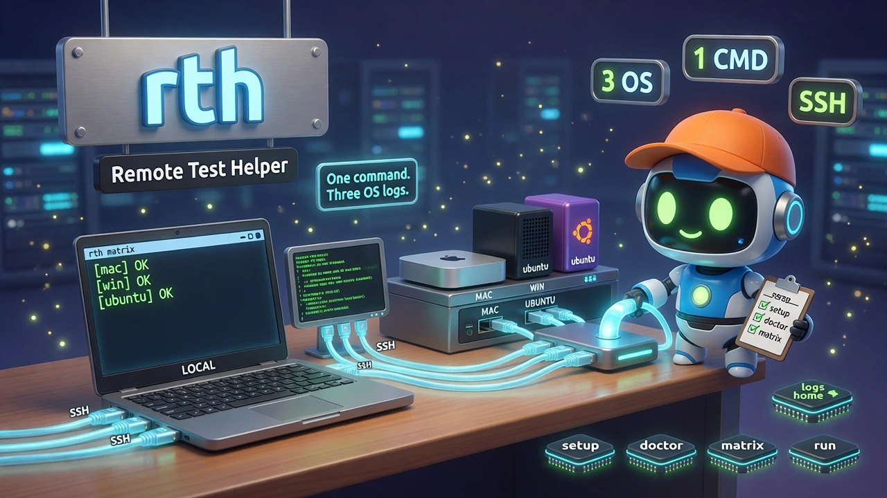

# rth — Remote Test Helper

<div align="center">
  
</div>

<div align="center">


</div>

**One command. Three OS logs. No clipboard hopscotch.**  
`rth` lets you (or an AI coding agent) run the same install/smoke/feature checks on **Mac Mini**, **Windows**, and **Ubuntu WSL** over SSH from any machine, and stream the results back to your terminal—so the fix→release→retest loop stays on one screen.

<div align="center">

```bash
curl -fsSL "https://raw.githubusercontent.com/quangdang46/remote_test_helper/main/install.sh?$(date +%s)" \
  | bash -s -- --easy-mode
```

```powershell
# Windows PowerShell (window stays open; no exit)
irm "https://raw.githubusercontent.com/quangdang46/remote_test_helper/main/install.ps1" | iex
# if WSL hangs:  $env:RTH_FORCE_GITBASH="1"; irm ... | iex
```

</div>

> **Status:** v0.1.0 implemented (Bash CLI + installers).

---

## Agent Quickstart

Use structured flags. Do **not** rely on interactive prompts for agent loops.

```bash
# 0) Lab bring-up playbook (agents: prefer --json)
rth guide --json
rth guide windows

# 1) Health of the lab
rth doctor --json

# 2) Install-link style check on Windows only (your current workflow)
rth run -e win -- 'curl -fsSL https://example.com/install.sh | bash -s -- --easy-mode'

# 3) Did the binary land?
rth run -e win -- 'mycli --version'

# 4) Same smoke on all three hosts
rth matrix -- 'mycli --version'

# 5) Feature-by-feature (paste errors are obsolete—logs already on Mac)
rth run -e win -- 'mycli feature-a --tmp /tmp/rth'
rth matrix -- 'mycli self-test --tmp /tmp/rth-smoke'

# 6) Optional save for CI/agents
rth matrix --save -- 'echo rth-ok'
```

| Stream | Contract |
|--------|----------|
| **stdout** | Remote command output (prefixed `[mac]` / `[win]` / `[ubuntu]` on matrix) |
| **stderr** | `rth` diagnostics (SSH, config, timeouts) |
| **exit 0** | All selected envs succeeded |
| **exit 2** | Partial failure (some envs failed) |
| **exit 3** | Unreachable / auth (command not run) |
| **exit 1** | Usage / config error |

Agents: prefer `--json` when parsing. Keep remote commands simple (quoting hell across `ssh → cmd → wsl` is real).

---

## TL;DR

### The Problem

Building tools for AI agents means proving them on **real** shells—not one laptop:

1. Copy install URL → paste on Windows → hope it works  
2. On failure, **copy the error back to Mac** to fix  
3. Retest features **one by one**, pasting failures again  
4. Repeat for Ubuntu/WSL  

That loop is correct—but the hopping and clipboard tax is pure waste.

### The Solution

`rth` is a small **Bash CLI** for a 3-host lab (LAN/VPN + SSH):

- Any of Mac / Windows / WSL can be the **controller**
- `run` = one host; `matrix` = same command on many hosts  
- Logs stream to **your current terminal** (optional `--save` files)  
- `setup` + `doctor` guide OpenSSH keys (especially Windows footguns)  
- Install via **curl** (Unix) and **irm** (Windows), RCH / release-curl style  

Not a shared live TTY. Not remote compilation—that is [`rch`](https://github.com/Dicklesworthstone/remote_compilation_helper).

### Why rth?

| Capability | What you get |
|------------|----------------|
| Multi-controller | Mac, Windows, or WSL can drive the others |
| Matrix logs | One command → `[mac]` / `[win]` / `[ubuntu]` streams |
| Install-loop native | `rth run -e win -- 'curl … \| bash'` replaces paste-to-Windows |
| Feature-loop native | Test feature N; failures already on the controller |
| Setup first-class | `rth setup` / `doctor` for keys + OpenSSH + WSL hop |
| Agent-friendly | `--json`, stable exit codes, non-interactive `run`/`matrix` |
| Light stack | Bash + OpenSSH; no daemon, no worker agent |
| Honest scope | Complements RCH; does not offload `cargo build` |

### Comparison

| | **rth** | **RCH** | **pssh / fabric / ansible ad-hoc** |
|--|---------|---------|-------------------------------------|
| Job | Multi-OS **test/check** + terminal logs | Remote **compile** offload for agents | Generic multi-host exec |
| Hosts | Mac + Windows + WSL lab | Linux workers | Usually Linux |
| UX | Explicit `run` / `matrix` | Hook + fail-open local | Inventory + playbooks |
| Windows | First-class (`cmd`) | Not the design center | Awkward |
| Agent loop | Exit codes + `--json` | Hook protocol + `exec` | DIY |
| Setup | Lab SSH wizard | Workers + daemon + `rch-wkr` | Your YAML/SSH |

---

## Quick Example — your real loop

```bash
# First time on controller
rth setup
rth doctor

# A) Install link on Windows (instead of manual paste)
rth run -e win -- \
  'curl -fsSL https://raw.githubusercontent.com/YOU/YOUR_TOOL/main/install.sh | bash -s -- --easy-mode'
rth run -e win -- 'yourcli --version'

# Fail? Log is already on this Mac terminal → fix repo → re-release → re-run above

# B) Feature-by-feature
rth run -e win -- 'yourcli feature-login'
rth run -e win -- 'yourcli feature-export --tmp %TEMP%\rth'
rth matrix -- 'yourcli --help'          # parity glance on 3 OS

# C) After a fix on Mac
rth matrix -- 'yourcli --version && yourcli smoke'
```

---

## Design principles

| Principle | Meaning |
|-----------|---------|
| Terminal logs are the product | No hidden remote-only log file required for the main loop |
| Controller is whoever you are on | All three machines can drive the fleet |
| Setup is half the tool | SSH keys / Windows Admin authorized_keys documented and probed |
| Simple commands win | Prefer short remote strings; document quoting limits |
| Fail loudly with next steps | Doctor/setup point at the exact OS footgun |
| Stay out of RCH’s lane | Builds/offload stay with RCH; rth proves shipped CLIs |

---

## Installation

### macOS / Linux / WSL

```bash
curl -fsSL "https://raw.githubusercontent.com/quangdang46/remote_test_helper/main/install.sh?$(date +%s)" \
  | bash -s -- --easy-mode
```

Flags: `--dest`, `--share`, `--version` / `--branch`, `--verify`, `--uninstall`, `--quiet`, `--from-source`.

### Windows PowerShell

```powershell
# Requires WSL (ready) or Git for Windows
irm "https://raw.githubusercontent.com/quangdang46/remote_test_helper/main/install.ps1" | iex
```

If `irm | iex` errors, save then run:

```powershell
irm "https://raw.githubusercontent.com/quangdang46/remote_test_helper/main/install.ps1" -OutFile $env:TEMP\rth-install.ps1
powershell -ExecutionPolicy Bypass -File $env:TEMP\rth-install.ps1
```

Prefers **WSL** when `wsl -e true` works; else Git Bash + `rth.cmd`.

### From source (dev)

```bash
git clone https://github.com/quangdang46/remote_test_helper.git
cd remote_test_helper
./install.sh --easy-mode --verify
# or: ./bin/rth --help
```

---

## Quick Start

```bash
rth guide          # full setup playbook (agents: rth guide --json)
rth guide windows  # paste-ready Windows OpenSSH + pubkey steps
rth setup          # create config + SSH key
rth doctor         # 3 hosts green/red
rth list           # mac, win, ubuntu
rth status         # short online summary

rth run -e mac -- 'uname -a'
rth run -e win -- 'ver'
rth run -e ubuntu -- 'uname -a'

rth matrix -- 'echo rth-ok'
rth matrix --save -- 'curl --version'
```

Default Windows shell: **cmd**. Override: `rth run -e win --shell powershell -- 'Get-Host'`.

Default Ubuntu path: **SSH to Windows → `wsl -d Ubuntu -- bash -lc '…'`** (stable). Direct WSL SSH is phase 2.

---

## Commands (v1 surface)

| Command | Purpose |
|---------|---------|
| `rth guide` | Agent/human setup playbook (`--json` for structured steps) |
| `rth setup` | Create config + SSH key (does **not** configure Windows alone) |
| `rth doctor` | Connectivity + shell smoke |
| `rth status` | Online / OS / user snapshot |
| `rth list` | Configured env names |
| `rth run -e <env> -- <cmd…>` | One environment |
| `rth matrix [-e a,b] -- <cmd…>` | Many environments |
| `rth ssh <env>` | Interactive shell (debug) |

### Common flags

| Flag | Meaning |
|------|---------|
| `-e, --env` | `mac` / `win` / `ubuntu` or comma list |
| `--json` | Machine-readable result |
| `--save` | Also write `./logs/<ts>/<env>.log` |
| `--timeout N` | Seconds (default ~30) |
| `--serial` | Matrix without parallel jobs |
| `--shell cmd\|powershell` | Windows only |

Deferred: `push` / `pull`, built-in `self-test` suite, direct WSL port-2222 automation.

---

## Configuration

**Path:** `~/.config/rth/hosts.conf`  
**Override:** `RTH_CONFIG=/path/to/hosts.conf`  
**Format:** shell-sourceable keys (no TOML parser in v1).

```bash
# ~/.config/rth/hosts.conf (example — created by rth setup)
RTH_ENVS="mac,win,ubuntu"

mac_kind="local"                 # local | ssh
mac_label="Mac Mini"
mac_shell="bash"
mac_workdir="$HOME/agent-ws"

win_kind="ssh"
win_label="Windows Laptop"
win_host="192.168.1.20"          # or hostname; prefer DHCP reservation
win_user="YourWindowsUser"
win_port="22"
win_shell="cmd"                  # cmd | powershell
win_workdir="C:/Users/YourWindowsUser/agent-ws"

ubuntu_kind="wsl"                # hop: ssh win + wsl
ubuntu_host="192.168.1.20"       # usually same as win
ubuntu_user="YourWindowsUser"
ubuntu_port="22"
ubuntu_distro="Ubuntu"
ubuntu_shell="bash"
ubuntu_workdir="~/agent-ws"

RTH_SSH_OPTS="-o ConnectTimeout=8 -o BatchMode=yes -o StrictHostKeyChecking=accept-new"
```

---

## Architecture

```text
Controller (any of 3) ── rth + hosts.conf
        │
        ├─ mac     → local shell  or  SSH :22
        ├─ win     → SSH OpenSSH Server :22 → cmd /c "…"
        └─ ubuntu  → SSH win → wsl -d Ubuntu -- bash -lc "…"
```

Transport is **SSH only**. No custom daemon in v1.

---

## Lab prerequisites

| Host | Need |
|------|------|
| Mac Mini | SSH client; optional Remote Login if others SSH in |
| Windows | OpenSSH **Server**, firewall, key auth |
| Ubuntu | WSL distro running; hop via Windows (v1) |
| Network | Same LAN/VPN; stable hostnames or reserved IPs |
| Auth | Ed25519 keys — `BatchMode` (no password hang for agents) |

**Windows key footgun:** users in Administrators often need the public key in  
`C:\ProgramData\ssh\administrators_authorized_keys` (strict ACL), not only `C:\Users\…\.ssh\authorized_keys`.  
`rth setup` / docs will spell this out; `doctor` should fail with a next action.

---

## Troubleshooting

| Symptom | Cause | Fix |
|---------|--------|-----|
| `exit 3` / Permission denied | Key not authorized / Admin path wrong | `rth setup` Windows checklist; fix authorized_keys path + ACL |
| ubuntu red, win green | WSL stopped or wrong distro name | On Windows: `wsl -l -v`; set `ubuntu_distro`; `wsl -e true` |
| Hang in agent | Password prompt | Use keys + `BatchMode=yes` (default SSH opts) |
| Quotes explode on win | Nested `ssh` + `cmd` | Shorten remote command; avoid deep nesting |
| Host unreachable after reboot | WiFi DHCP changed IP | DHCP reservation or hostname; update `win_host` |
| `rth: command not found` | PATH | Re-open shell after `--easy-mode` install |

---

## Limitations

- **Not realtime** shared terminals (no tmux mirror).  
- **Not** a compile offloader—use **RCH** for remote `cargo`/gcc.  
- v1 Ubuntu path depends on **Windows + WSL hop**, not direct LAN SSH to WSL.  
- Complex remote quoting on Windows is brittle—keep commands simple.  
- No `push` of local binaries in v0.1 (install-link and PATH-based tools first).  
- Remote envs need working SSH keys (`rth setup` / `rth doctor`).

---

## FAQ

**Q: Does this replace pasting the install link on Windows?**  
A: Yes in spirit: `rth run -e win -- 'curl … \| bash …'` runs it remotely and prints the log on the controller.

**Q: Can every machine be the controller?**  
A: Yes—that is a design goal. Install `rth` on each; config marks self as `local`.

**Q: Default Windows shell?**  
A: `cmd`. PowerShell via `--shell powershell`.

**Q: How is this different from RCH?**  
A: RCH offloads **builds** to Linux workers via hooks. `rth` **checks** tools on Mac/Win/WSL with explicit matrix logs.

**Q: Do I need keys before anything works?**  
A: Local `mac_kind=local` works immediately. Remote envs need OpenSSH + key auth; `setup`/`doctor` exist for that.

**Q: Will agents auto-fix my code from remote logs?**  
A: No. `rth` delivers logs + exit codes; the agent (or you) still fixes on Mac and retests.

**Q: Why Bash not Rust for v1?**  
A: Fast path for SSH orchestration and installers; Rust is an optional later rewrite if quoting pain demands it.

---

## Docs

| Doc | Role |
|-----|------|
| `README.md` | Product overview + CLI |
| `docs/AGENT.md` | Agent card |
| `docs/SSH_WINDOWS.md` | OpenSSH + authorized_keys |
| `docs/SSH_WSL.md` | WSL hop |
| `tests/smoke.sh` | Local automated checks |

**Commands:** `guide` · `setup` · `doctor` · `status` · `list` · `run` · `matrix` · `ssh` · `install.sh` / `install.ps1`.

## Development / CI

```bash
./tests/smoke.sh
```

CI (GitHub Actions): smoke on Ubuntu + macOS, ShellCheck, install.sh dry-run.  
Release: push tag `v0.1.0` → source tarball on GitHub Releases.

---

<div align="center">

**Same command. Three environments. Logs home.**

</div>
